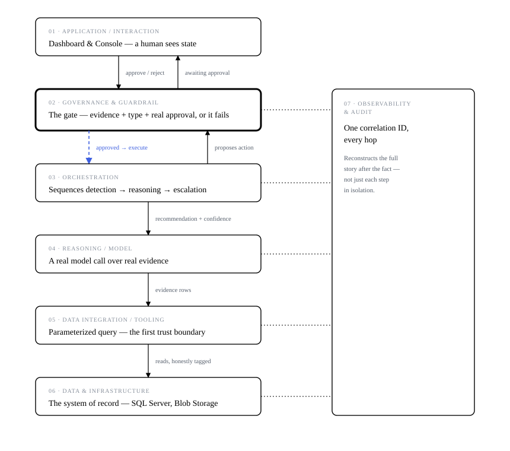
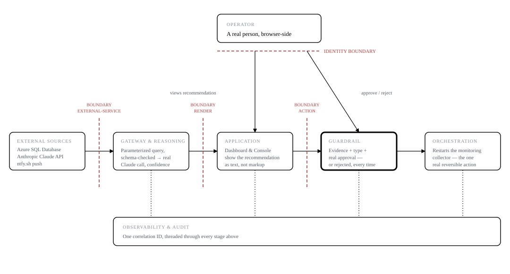

# CoreOps — AI Operations Platform

CoreOps is an AI operations platform for SQL Server, SSIS, SSRS, and Windows
infrastructure: it monitors telemetry, correlates failures across services, uses
Claude to reason about root cause and business impact, and proposes remediations —
but nothing writes to a monitored system without a real, authenticated human
approving it first, and every decision leaves a durable, reconstructable record of
who approved what and when.

That last part is the design's actual center of gravity. Automation that ops teams
can't audit or override doesn't get trusted into production; automation with no
oversight at all is worse than the outage it's meant to prevent. CoreOps is built
around the boundary between "the AI proposes" and "a verified human decides" being
real, enforced in code, and provable after the fact — not a policy comment.



## See it running

A real production deployment is live at
[coreops.fly.dev](https://coreops.fly.dev) (Fly.io, STORY-012). Without
credentials you'll hit the real login page, not a demo — that's the point,
the human-approval gate is real, not a UI mockup. What's checkable with no
login at all: `curl https://coreops.fly.dev/health/dependencies` returns the
same honest `live`/`fallback` tagging described throughout this doc, live,
right now — SQL Server currently reports `fallback` in this deployment, shown
plainly rather than disguised as a live connection.

To run it yourself:

**You don't need real SQL Server access to try this.** If `SQLSERVER_*` is
unset, the DMV read tool falls back to fixture data automatically, same for
`AZURE_STORAGE_CONNECTION_STRING`/SSRS. The real setup step is auth, not
infrastructure: generate a password hash and a TOTP secret first, since the
server fails fast at startup without both.

```bash
cd mcp-server
npm install
cp .env.example .env
npm run hash-password -- '<your password>'       # paste the result into AUTH_PASSWORD_HASH
npm run generate-totp-secret                     # paste the result into MFA_TOTP_SECRET
# fill in ANTHROPIC_API_KEY too — see .env.example for what's required vs. optional
npm run http
```

Then open `http://localhost:8787/` — sign in at `/login`, then a live dashboard
showing real SQL Server DMV incident data and a "Recommend Remediation" flow that
runs the real guardrail, live, in the browser: propose an action, approve or reject
it as the authenticated user, and watch the decision land in the audit trail.

For the network-facing MCP transport (AI agents connecting over HTTP, not just
local stdio):

```bash
cd mcp-server
npm run http-mcp
```

See [`.env.example`](mcp-server/.env.example) for the auth setup both need.

For the role-based Operations Console served the way it would be in a real
deployment (one origin, no dev proxy, session cookies just work):

```bash
cd mcp-server
npm run build-console
npm run http
```

Then open `http://localhost:8787/console?role=it-manager`.

## What's real

Every claim below has a test behind it and was verified against a real running
server, not just unit-tested. Current counts, re-run 2026-09-16: **457 tests
passing** — 387 in `mcp-server/`, 70 in `guardrails/`, 6 in `frontend/` (the
frontend count is source-verified — `grep -c "  it(" frontend/src/App.test.tsx`
— rather than executed in every environment, since vitest's worker pool can be
blocked by sandbox restrictions on spawning workers; it ran clean the last time
it was executed).

**Governance & security**
- Session-based authentication (`mcp-server/src/auth/`) gates every route —
  `scrypt` password hashing, `HttpOnly`+`SameSite=Strict` session cookies, no
  raw credential ever touches client-side JS.
- Real TOTP-based MFA (RFC 6238), hand-rolled with `node:crypto` — verified
  against the published RFC test vectors, with drift-tolerant, replay-protected
  code verification. Login requiring TOTP makes every session inherently
  MFA-verified; a guardrail decision's `mfa` check used to be a hardcoded
  placeholder — see [ADR-006](docs/ADR-006-totp-mfa.md) for the fix.
- The human-approval guardrail (`guardrails/`) blocks any action lacking real
  evidence, an allowed reversible type, or a genuine approval — and only the
  assigned approver, verified by real login, can decide it. That check used to
  compare a hardcoded value against itself and could never actually fail; see
  [ADR-003](docs/ADR-003-session-based-authentication.md) for the fix.
- A second, real approver identity with its own credentials and MFA, closing a
  single-operator gap — the queue's escalate-to-backup-approver path was fully
  tested but unreachable from the live server (the timeout check it depends on
  was never called). Live-verified with a genuine 15-minute wait: a real second
  human decided an item after real escalation, and the original approver was
  locked out with a `403` naming the switch — see
  [ADR-007](docs/ADR-007-second-approver-identity.md).
- Rate limiting on every HTTP surface — closes a real, confirmed-absent gap
  found during a trust audit, not a precaution added speculatively.
- A network-facing MCP tool gateway (`mcp-server/src/httpMcpServer.ts`), gated
  by bearer-token auth, giving AI agents read-only access to live diagnostics
  with zero write privileges — see [ADR-001](docs/ADR-001-mcp-transport-selection.md).
- Every confidence threshold this system acts on (insufficient-evidence,
  differential-gathering, human-escalation) is configurable via env var,
  validated and fail-fast on a malformed value rather than silently disabling
  the gate it controls — `mcp-server/src/confidenceThresholds.ts`.
- An evidence grounding check (`mcp-server/src/evidenceGroundingCheck.ts`)
  cross-checks every AI recommendation's cited evidence IDs against the
  evidence it was actually given, flagging a fabricated citation or a
  diagnosis that cited nothing at all — closing the gap named by the hardest
  question in Expo demo-prep review: what stops a confident-but-wrong
  recommendation from reaching a human approver with no independent signal.
  Live-verified against a real Claude response (no false positive) and a
  deliberate break test proving the failure path actually renders — see
  [ADR-008](docs/ADR-008-evidence-grounding-check.md). Extended one level
  deeper by structured claim verification — the model now cites the exact
  field and value backing each specific fact in its diagnosis, checked
  against the real evidence, catching a citation that's real but misstated,
  not just a fabricated one. Live-verified against a real Claude response
  that complied correctly on the first attempt — see
  [ADR-009](docs/ADR-009-structured-claim-verification.md). Neither check
  makes human approval less necessary — only better-informed; the approval
  gate itself is untouched by design.

**Audit trail**
- Every decision and action is recorded immutably and idempotently by ID
  (`guardrails/auditLog.ts`), reconstructable end-to-end by correlation ID via
  `GET /api/audit?correlationId=`.
- Persisted to disk, not just in-memory — proven by killing the running server
  mid-session and confirming a prior approval decision was still retrievable
  afterward. See [ADR-005](docs/ADR-005-audit-trail-persistence.md).
- Bounded by size-based rotation, never deletion — every entry ever recorded
  stays queryable forever, split across numbered archive segments instead of
  one unbounded file. Live-verified against a copy of the real, running
  audit log's actual data, not synthetic data. See ADR-005's implementation
  addendum.

**Reasoning & reliability**
- The Root Cause Analysis Agent (`mcp-server/src/rootCauseAgent.ts`) makes real
  Claude Sonnet 5 calls over real DMV evidence — zod-validated output,
  evidence-attributed, never fabricates a result when evidence is thin or the
  API call fails. Below 80% confidence, it gathers a differential instead of
  presenting one guess.
- A generic timeout + capped-retry + circuit-breaker wrapper
  (`mcp-server/src/reliability/`) around every upstream call — SQL Server and
  the Anthropic API alike.
- Live data is honestly tagged `live` vs. `fallback` — an unreachable SQL
  Server is a visible notification, never a silent fixture substitution. The
  same fixture-first pattern now also covers SSRS report-execution monitoring
  (`mcp-server/src/ssrsReader.ts`, querying `ExecutionLog3`), and the pattern
  itself has been live-verified against a real running open-source system
  (Apache Superset — see `mcp-server/dev-superset/`), not just mocks.
- Cross-system correlation (REQ-017): `GET /api/correlated-recommendation`
  (`mcp-server/src/correlatedRecommendationService.ts`) gathers live evidence
  from SQL Server DMVs and SSRS together and hands it all to one root-cause
  call, instead of the two single-source routes that came before it —
  correlation happens at the LLM reasoning layer, not a fabricated join key
  (the two systems' row shapes share no real key in this codebase). Degrades
  honestly when one source is down (flags `partialCorrelation`, never silently
  drops to single-source and calls it complete); live-verified against the
  real current state of this deployment, where both sources are genuinely
  unavailable for two different real reasons.
- Semantic dedup for `triage_active_incidents` (`mcp-server/src/triageSemanticCache.ts`):
  evidence text is embedded locally (`@huggingface/transformers`, no paid API) and
  checked against a real **vector database** — a dedicated `pgvector`-backed
  Postgres instance (`mcp-server/dev-vector-db/`) — so a near-duplicate incident
  (same underlying issue, slightly different wording or values) reuses a recent
  judgment instead of triggering a fresh AI call. Sits on top of an exact-match
  cache for byte-identical evidence; entirely optional at runtime (`PG_VECTOR_HOST`
  unset disables it with zero behavior change). Live-verified against a real
  running container: a genuine near-duplicate matched at cosine distance 0.0047,
  a genuinely different incident correctly did not match. See
  [ADR-015](docs/ADR-015-triage-semantic-cache-pgvector.md).

**Interfaces**
- `dashboard.html` — the primary operations dashboard, `apiFetch()`-wrapped so
  a session expiring mid-use redirects to `/login` instead of failing silently.
- The Operations Console (`frontend/`, React + Vite) — role-based summaries,
  an honest error state for any unrecognized role, served same-origin from
  `mcp-server` itself in the deployment path (see
  [ADR-004](docs/ADR-004-console-serving-topology.md)).

## Architecture decisions

Fifteen ADRs, each with real alternatives considered and rejected, not just the
choice made:

| ADR | Decision |
|---|---|
| [ADR-001](docs/ADR-001-mcp-transport-selection.md) | MCP transport selection — StreamableHTTP for network callers, stdio kept for local dev, bearer-token auth |
| [ADR-002](docs/ADR-002-audit-trail-correlation-id-unification.md) | Unifying correlation IDs between the audit log and `mcp-server`'s operational logging |
| [ADR-003](docs/ADR-003-session-based-authentication.md) | Session-based auth over JWT — no distributed system for JWT's statelessness to help with, and a JWT in `localStorage` sits in the same XSS exposure class an audit had just closed |
| [ADR-004](docs/ADR-004-console-serving-topology.md) | Serving the built console from `mcp-server` itself, not a reverse proxy that doesn't exist yet |
| [ADR-005](docs/ADR-005-audit-trail-persistence.md) | Append-only JSONL persistence for the audit trail, chosen over SQLite to avoid a first-ever database dependency; size-based rotation into numbered archives over time-based or deletion, added in a later addendum |
| [ADR-006](docs/ADR-006-totp-mfa.md) | Real TOTP-based MFA over an ntfy-delivered OTP or WebAuthn — hand-rolled with `node:crypto`, and login itself requiring TOTP makes every session inherently MFA-verified, closing a hardcoded placeholder |
| [ADR-007](docs/ADR-007-second-approver-identity.md) | A real second approver identity over a general N-user credential store — mirrors the existing single-user pattern for exactly the two roles the escalation model actually has |
| [ADR-008](docs/ADR-008-evidence-grounding-check.md) | A citation-existence check, generic over opaque evidence, over a second "critic" LLM call (not actually independent) or per-source semantic verification (couples a shared module to three separately-evolving schemas) |
| [ADR-009](docs/ADR-009-structured-claim-verification.md) | Structured claim-to-field verification over a fuzzy semantic/substring check — the model cites the exact field and value backing each fact, checked with an exact (not inferred) comparison, avoiding the false-positive risk a text-similarity check would carry |
| [ADR-010](docs/ADR-010-sql-remediation-safety.md) | Source-aware remediation with real DBA-style safety judgment, over the single hardcoded demo action every incident previously proposed regardless of source |
| [ADR-011](docs/ADR-011-moroccan-theme-system.md) | A shared day/night theme system across all three UI surfaces, restyled with zero business-logic, API, or routing changes |
| [ADR-012](docs/ADR-012-real-docker-execution.md) | One real execution path — Docker/Superset restart — over extending real writes to SQL Server or IIS, since this is the one target already under direct, unprivileged, reversible control; execution and confirmation kept as two separate steps so a restart is never reported fixed until independently confirmed healthy |
| [ADR-013](docs/ADR-013-real-postgres-remediation.md) | A second real execution path — a real Postgres blocking-query kill — over repurposing or renaming the existing demo Postgres container (rejected, breaks an unrelated working demo) or cloning the Docker case onto a second container (rejected, proves nothing new) |
| [ADR-014](docs/ADR-014-mcp-roots-containment-order.md) | Resolve the real filesystem path first, compare against declared MCP roots second — the only order that closes a symlink or `../` traversal escape, verified against a real symlink and a real traversal attempt, not just reasoned about |
| [ADR-015](docs/ADR-015-triage-semantic-cache-pgvector.md) | A dedicated pgvector container with local, in-process embeddings for near-duplicate incident matching, over a paid embeddings API (no per-call cost or new external failure mode) or skipping semantic matching entirely (misses the real near-duplicate pattern this tool actually sees) |

The full architecture package — a written summary, layer diagrams, and a
trust-boundary data-flow diagram — is in
[`project-blueprint/expo/`](project-blueprint/expo/).

## The core design guarantee

Exactly one path in this system can write anything to a monitored server, and it
can only act after a human explicitly approves a pending remediation. Every
collector, every AI agent, and every read path is architecturally incapable of
writing to production, not just policy-incapable. This is enforced in code and
covered by tests — not just a design claim.

## The design + planning layer



| Path | What it is |
|---|---|
| [`project-blueprint/architecture.md`](project-blueprint/architecture.md) | The full system architecture: 18 components, a Mermaid flowchart, a data-flow walkthrough, a 6-phase build order, and what the design deliberately doesn't cover. |
| [`project-blueprint/tech-stack.md`](project-blueprint/tech-stack.md) | One fit-rated technology recommendation per component, plus alternatives considered. |
| [`project-blueprint/requirements.md`](project-blueprint/requirements.md) | Per-requirement traceability (UNMAPPED / PLANNED / BUILT) — every claim points at a real test. |
| [`project-blueprint/demo-script.md`](project-blueprint/demo-script.md) | A 90-second screencast script, every command verified against real output. |

## Programme tracking (Command Center)

This repo also tracks a separate, formally-scoped programme (11 stories across 5
releases, 18 requirements) in `.colaberry/plan.json` + `.colaberry/progress.json`,
viewable via a local status dashboard:

```bash
python3 -m http.server   # from the repo root
```

Then open `http://localhost:8000/` (must be served over HTTP, not `file://`).
Every tab has a Sample/Real toggle — Real shows exactly what's recorded in
`.colaberry/progress.json`'s `verification` block, which the Colaberry
platform owns and writes separately from the `passed`/`evidence` fields the
coding session itself reports (see
[`docs/DATA_CONTRACT.md`](docs/DATA_CONTRACT.md)). That's a real separation
from a bare self-declaration, but this repo alone can't establish what the
platform's own verification run consists of, so don't oversell it as
independent human review unless you can point to what that process actually
is.

## Status

Not a finished product — `project-blueprint/requirements.md` and
`.colaberry/progress.json` are both honest about what's real vs. planned, with a
test or an in-browser check for every claim. Nothing is marked done without one.
