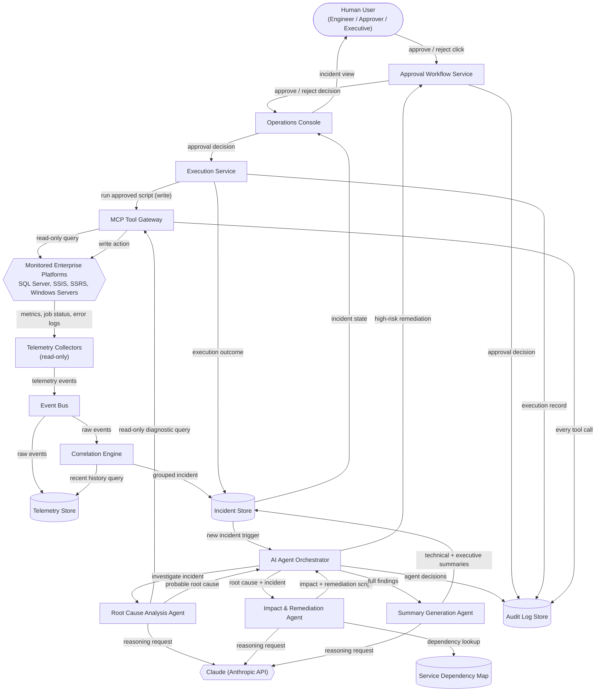
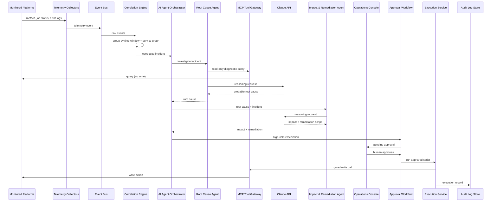
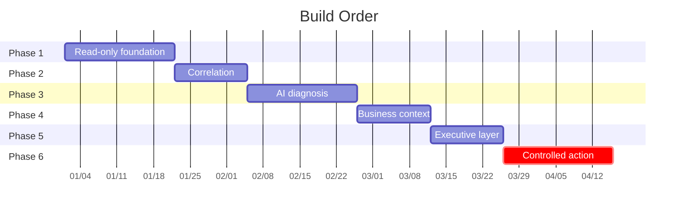

# AI Operations Center — System Architecture

## The Idea

> Design an enterprise-grade AI Operations Center that serves as an intelligent
> command center for SQL Server, SSIS, SSRS, Windows servers, and enterprise
> data platforms. The system should continuously monitor operational
> telemetry, correlate failures across multiple services, identify root
> causes using Claude, assess downstream business impact, recommend safe
> remediation steps, generate diagnostic SQL or PowerShell scripts, and
> present both technical and executive-friendly incident summaries. The
> architecture must be secure, scalable, and production-ready, using AI
> agents, MCP tools, event-driven workflows, audit logging, human approval
> for high-risk actions, and a read-only monitoring layer.

**The sentence that outranks everything else:** *"...secure, scalable, and
production-ready, using ... a read-only monitoring layer"* combined with
*"human approval for high-risk actions."* An Ops Center that watches
production SQL Server, SSIS, SSRS, and Windows infrastructure only earns the
right to exist if it cannot itself become the incident. Everything below is
built around one structural guarantee: **exactly one component in this system
can write anything to a monitored server — the Execution Service — and it can
only act after the Approval Workflow Service records a human's sign-off.**
Every collector, every AI agent, every read path is architecturally incapable
of writing to production, not just policy-incapable. That guarantee is what
makes the rest of the design ("correlate," "identify," "assess," "recommend,"
"generate," "present") safe to automate at all.

---

## Components

| Component | Category | What it does for this project | Words that required it | Technology |
|---|---|---|---|---|
| Telemetry Collectors | Read-only collector | Continuously pulls job status, error logs, and performance counters from every SQL Server, SSIS, SSRS, and Windows Server instance being watched, without ever writing to them. | "continuously monitor operational telemetry" · "SQL Server, SSIS, SSRS, Windows servers" · "read-only monitoring layer" | Telegraf |
| Event Bus | Infrastructure | Carries every telemetry event from the collectors to whatever needs to react to it, so a burst of failures across many servers doesn't overwhelm any single consumer. | "event-driven workflows" · "continuously monitor... across multiple services" | Apache Kafka |
| Telemetry Store | Data store | Keeps a rolling history of every metric and log line so the Correlation Engine and AI agents have a recent baseline to compare against, not just the current spike. | "continuously monitor operational telemetry" · "correlate failures" | TimescaleDB |
| Correlation Engine | Service (deterministic) | Groups near-simultaneous failures across different services into one incident instead of leaving operators to spot the pattern themselves. | "correlate failures across multiple services" | Faust (Python stream processing) — deliberately **not** an LLM call, so grouping is deterministic and testable on day one |
| Incident Store | Data store | Holds the full lifecycle of an incident — telemetry references, root cause, impact, remediation, summaries, approval state — so nothing is lost between detection and closure. | "correlate," "identify root causes," "assess... impact," "recommend... remediation" (state that outlives a session) | PostgreSQL |
| AI Agent Orchestrator | Service | Runs the fixed sequence of AI agents against a new incident and passes each agent's output to the next, so root cause → impact → remediation → summaries happen in the same order every time. | "using AI agents" · the paragraph's own verb sequence (identify, assess, recommend, generate, present) | Claude Agent SDK, state-machine per incident |
| Root Cause Analysis Agent | AI agent | Asks Claude to explain why the correlated failures happened, using live read-only queries against the affected systems as evidence instead of guessing from telemetry alone. | "identify root causes using Claude" | Claude Sonnet 5 (Anthropic API) + MCP Tool Gateway (read path) |
| Impact & Remediation Agent | AI agent | Looks up what the failing system feeds downstream, has Claude state the business impact in plain terms, and drafts a remediation plan with an actual diagnostic SQL or PowerShell script attached. | "assess downstream business impact" · "recommend safe remediation steps" · "generate diagnostic SQL or PowerShell scripts" | Claude Opus 5 (Anthropic API) + Service Dependency Map |
| Summary Generation Agent | AI agent | Turns the root cause, impact, and remediation plan into two versions of the same incident — one for engineers, one for executives — without a human rewriting either by hand. | "present both technical and executive-friendly incident summaries" | Claude Haiku 4.5 (Anthropic API) |
| MCP Tool Gateway | Service | Gives every AI agent one permissioned way to query SQL Server, SSIS, SSRS, and Windows Servers — read-only by default, with a separate write path only the Execution Service may call, and only after approval. | "MCP tools" · "read-only monitoring layer" · the write path implied by "remediation" + "human approval" | Model Context Protocol (MCP) servers, least-privilege scoped service accounts |
| Service Dependency Map | Data store | Records which SSIS jobs feed which SSRS reports feed which business processes, so the Impact & Remediation Agent reasons over something concrete instead of inventing an impact story. | "assess downstream business impact" | PostgreSQL, ops-maintained |
| Approval Workflow Service | Service | Holds any remediation flagged high-risk in a pending state until a human explicitly approves or rejects it, and refuses to let the Execution Service run anything unsigned. | "human approval for high-risk actions" | PostgreSQL status column on the Incident Store + the existing Event Bus (not a separate workflow engine); a deterministic risk-classification policy table decides what counts as high-risk, never the AI |
| Execution Service | Service | Is the only component allowed to change anything on a target server, and only runs a script once the Approval Workflow Service confirms a human signed off. | "recommend safe remediation steps" joined with "human approval for high-risk actions" | PowerShell 7 (Constrained Language Mode) invoking the MCP Tool Gateway's write path; idempotent per run |
| Audit Log Store | Data store | Appends an immutable record of every telemetry event, tool call, agent decision, approval, and execution outcome, so any incident can be reconstructed after the fact. | "audit logging" | PostgreSQL with append-only triggers |
| Operations Console | Frontend | Is the one screen humans use to see an incident — technical detail or executive summary — and to approve or reject a proposed remediation. | "present both technical and executive-friendly incident summaries" · a human needs a UI to give "human approval" | React, role-based views (engineer / approver / executive) |
| Claude (Anthropic API) | External | Provides the reasoning every agent calls on to explain failures, assess impact, and write summaries in plain language. | "identify root causes using Claude" · "AI agents" | Anthropic Claude API — Sonnet 5, Opus 5, and Haiku 4.5 at different agent tiers |
| Monitored Enterprise Platforms | External | Is the actual SQL Server, SSIS, SSRS, and Windows Server infrastructure being watched, and — after approval — safely acted on. | "SQL Server, SSIS, SSRS, Windows servers, and enterprise data platforms" | Existing enterprise infrastructure (not built by this project) |
| Human User | Actor | Whoever opens the console to read an incident or approve a fix — same login, different view depending on role. | "human approval for high-risk actions" · "executive-friendly" | — |

Full technology fit ratings and reasoning for each row: [`tech-stack.md`](tech-stack.md).

No frontend was added beyond the Operations Console (one UI serves both audiences via role-based views — a second frontend would be padding). No queue exists beyond the Event Bus (telemetry is explicitly continuous and cross-service, which is exactly the bursty, fan-out workload a queue is for). No vector database was added — nothing in the idea asks for semantic search over unstructured content; the AI agents reason over structured telemetry and a structured dependency map, not a document corpus.

---

## How It Fits Together

**Deployment topology.** The Collectors, MCP Tool Gateway, and Execution
Service run closest to the monitored platforms (on-prem or in the same VNet),
each under its own least-privilege service account — a read-only account for
everything except the Execution Service's single write-scoped account. The
Event Bus, Telemetry Store, Correlation Engine, Orchestrator, the three AI
agents, Incident Store, Approval Workflow Service, Audit Log Store, and
Operations Console run centrally (a Kubernetes namespace or equivalent),
scaled independently since telemetry volume, correlation load, and AI agent
concurrency all grow at different rates. Only the MCP Tool Gateway and
Execution Service need network reachability *into* the monitored platforms;
everything else only needs reachability to the Event Bus, the data stores,
and the Anthropic API — which keeps the blast radius of a compromised
central-cluster credential away from production write access.

**Security notes.** Read access and write access are enforced by different
service accounts, not by an in-process flag — the Execution Service physically
cannot obtain a write-capable credential to the Telemetry Collectors' or MCP
Tool Gateway's read path. Risk classification for "is this remediation
high-risk" is a deterministic policy table (action type × target platform ×
environment), not a judgment call handed to Claude, so an agent cannot
reason its way around the approval gate. Every credential (service accounts,
the Anthropic API key used by the agents) is stored outside the repo/config
and redacted in any log line that references it, per this repo's Security
Enforcement Layer.

---

## Data Flow

1. **Telemetry Collectors** poll SQL Server, SSIS, SSRS, and Windows Servers
   on a fixed interval, read-only, and detect a change in job status, error
   count, or a performance counter.
2. Collectors publish a **telemetry event** onto the **Event Bus** and write
   the raw sample to the **Telemetry Store**.
3. The **Correlation Engine** consumes events off the Event Bus, compares
   them against recent history in the Telemetry Store, and groups
   near-simultaneous failures across services into a single incident.
4. The Correlation Engine writes the incident to the **Incident Store**,
   which triggers the **AI Agent Orchestrator**.
5. The Orchestrator calls the **Root Cause Analysis Agent**, which uses the
   **MCP Tool Gateway**'s read-only path to run diagnostic queries against
   the affected platform, then asks **Claude** to reason over the telemetry
   and query results together.
6. The Root Cause Analysis Agent returns a probable root cause; the
   Orchestrator writes it back to the Incident Store.
7. The Orchestrator calls the **Impact & Remediation Agent** with the root
   cause. The agent looks up the **Service Dependency Map** for downstream
   business impact and asks Claude to draft a remediation plan plus a
   diagnostic SQL or PowerShell script.
8. The Orchestrator calls the **Summary Generation Agent** with the root
   cause, impact, and remediation plan; Claude produces a technical summary
   and an executive-friendly summary, both written to the Incident Store.
9. If the remediation is flagged high-risk by the deterministic risk policy,
   the Orchestrator routes it to the **Approval Workflow Service** instead
   of straight to execution.
10. A **Human User** opens the **Operations Console**, reviews the incident
    in the view suited to their role, and approves or rejects the
    remediation.
11. On approval, the **Execution Service** calls the MCP Tool Gateway's
    gated write path to run the approved script against the target
    platform, and records the outcome in the Incident Store.
12. Every tool call, agent decision, approval decision, and execution
    outcome is appended to the **Audit Log Store** as it happens — the
    audit trail is written in real time, not reconstructed after the fact.

---

## Build Order

| Phase | Builds | What it proves |
|---|---|---|
| 1. Read-only foundation | Telemetry Collectors, Event Bus, Telemetry Store, Operations Console (read-only view) | The system can continuously ingest real telemetry from SQL Server, SSIS, SSRS, and Windows Servers without touching anything, and a human can see raw incidents. |
| 2. Correlation | Correlation Engine, Incident Store | A flood of raw events becomes one grouped incident instead of noise — deterministically, before any AI is involved. |
| 3. AI diagnosis | AI Agent Orchestrator, Root Cause Analysis Agent, MCP Tool Gateway (read path), Claude integration | Claude can actually explain *why* something broke using live read-only evidence, not just restate the telemetry. |
| 4. Business context | Service Dependency Map, Impact & Remediation Agent | The system can say who and what is affected downstream, and propose a concrete, safe fix — not just a diagnosis. |
| 5. Executive layer | Summary Generation Agent, dual-view Console | The same incident produces a usable executive summary with no human rewrite required. |
| 6. Controlled action | Approval Workflow Service, Execution Service, MCP Tool Gateway (write path), Audit Log Store | The system can safely execute a remediation — only with a human's sign-off and a full audit trail. The highest-risk capability, built last and gated hardest. |

---

## Assumptions

| Assumption | Impact if wrong |
|---|---|
| Read-only service accounts can be provisioned on every target SQL Server, SSIS, SSRS, and Windows Server host. | The "read-only monitoring layer" requirement can't be met without a provisioning/firewall project before Phase 1 can even start. |
| A Service Dependency Map exists or can be hand-built and maintained by ops — it is not auto-discovered from platform metadata. | The Impact & Remediation Agent's business-impact statements are only as good as this map; if it's stale, impact assessments will be confidently wrong even when the root cause is right. |
| "High-risk" remediation can be classified by a fixed, external policy (action type × target × environment), not left to the AI to judge. | If risk classification were the AI's call, an agent could reason its way around the approval gate — the policy must be deterministic and outside the model. |
| A single correlation time window (e.g., 5 minutes) is enough to group cross-service failures. | Too short misses slow-cascading failures (an SSIS failure that only shows up as an SSRS report gap an hour later); too long merges unrelated incidents into one false pattern. |
| The organization has its own Anthropic API access for the agents, separate from any personal key used elsewhere. | No architectural impact — noted only so the two Claude integrations (this system's agents vs. any other tool) aren't assumed to share a key or a budget. |

---

## What This Design Does Not Cover

- **Auto-discovery of the Service Dependency Map.** It's assumed to be
  maintained by ops or synced from a separate CMDB; this design doesn't
  include a discovery crawler.
- **Multi-tenant isolation.** This is one enterprise watching its own
  infrastructure, not a shared platform serving multiple customers.
- **High availability for the Ops Center's own infrastructure** (Event Bus
  replication, database failover, multi-region). Called out as a deployment
  concern above, not designed in diagram-level detail here.
- **Cost and rate-limit controls on Claude API usage during an incident
  storm** (e.g., hundreds of correlated incidents firing at once). This
  needs a throttling/backpressure design of its own before production.
- **Long-term retention and archival policy** for the Telemetry Store and
  Audit Log Store — both will grow without bound as designed.
- **Non-Microsoft-stack platforms** (Linux hosts, Oracle, other cloud data
  warehouses). Scoped strictly to what the idea named: SQL Server, SSIS,
  SSRS, Windows Servers, and enterprise data platforms in that family.

**The one question that would most change this design:** *Does "human
approval for high-risk actions" mean the Execution Service ever runs
anything automatically for low-risk actions, or does every remediation —
without exception — require a human click?* If the answer is "nothing ever
runs unattended," the Execution Service and Approval Workflow Service
collapse into one gate with no auto-execute path, and the risk-policy table
in Assumptions becomes unnecessary — every remediation is high-risk by
definition. If the answer is "low-risk actions can auto-run," the design
above is correct as drawn, but the risk-policy table becomes the single most
security-critical artifact in the whole system and would need its own
review process, versioning, and audit trail separate from the Audit Log
Store's per-incident records.
